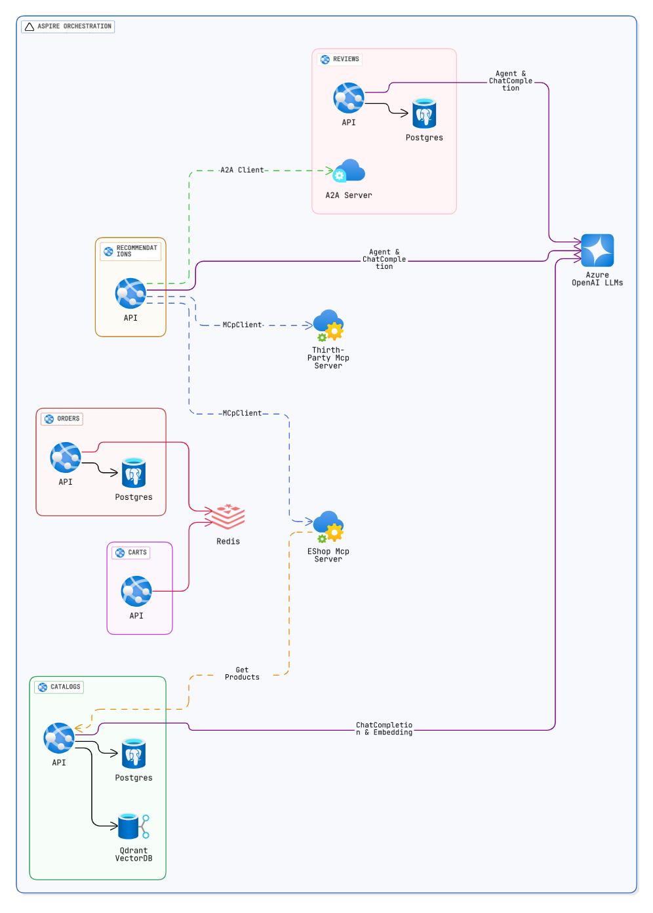

# GenAI-Eshop

> 💡 Practical `GenAI-Eshop` application using [microsoft/agent-framework](https://github.com/microsoft/agent-framework), `multi-agent orchestrations`, `Mcp tools`, `A2A Agents`, `Semantic Search` and more.

> [!NOTE]
> We migrated the `GenAI-Eshop` application to the [Semantic Kernel](https://github.com/microsoft/semantic-kernel) instead of [microsoft/agent-framework](https://github.com/microsoft/agent-framework) in the [mehdihadeli/genai-eshop-semantic-kernel](https://github.com/mehdihadeli/genai-eshop-semantic-kernel) repository. You can check their differences in a practical application there.

## Features

- ✅ Using [microsoft/agent-framework](https://github.com/microsoft/agent-framework) for multi-agent orchestrations
- ✅ Using `Qdrant Semantic Kernel Connector` for storing vector data for doing `Semantic Meaning Search` and `Hybrid Search` using vector data and semantic kernel
- ✅ Using [Microsoft.Extensions.AI](https://learn.microsoft.com/en-us/dotnet/ai/microsoft-extensions-ai) `EmbeddingGenerator` based on chosen providers like `Ollama`, `AzureOpenAI`, and `OpenAI` for generating vector data for semantic search
- ✅ Using [Microsoft.Extensions.AI](https://learn.microsoft.com/en-us/dotnet/ai/microsoft-extensions-ai) `ChatCompletion` based on chosen providers like `Ollama`, `AzureOpenAI`, and `OpenAI` for communicating with different models for generating responses
- ✅ Using `Mcp tools` based on `http` and json-rpc for calling endpoints in our Mcp server and calling third party tools by LLMs for Fine-grained functions
- ✅ Using `Multi-Agent Orchestrations` for `local` and `external` agents communication using agents `parent child agent relationships` and different [Microsoft Agent Framework](https://github.com/microsoft/agent-framework) `Orchestration Patterns` like `Parent-Child`, `GroupChat` and `Sequential` orchestration.
- ✅ Using `Agent2Agent Protocol (A2A)` protocol based on http and json-rpc for calling and using external agents
- ✅ Using `Vertical Slice Architecture` as a high-level architecture
- ✅ Using `Minimal APIs` for handling requests
- ✅ Using `OpenTelemetry` for collecting `Logs`, `Metrics` and `Distributed Traces`
- ✅ Using `.NET Aspire` for cloud-native application orchestration and enhanced developer experience

## Architecture Diagram



## Getting Started

### Prerequisites

- [.NET 10.0 SDK](https://dotnet.microsoft.com/download/dotnet/)
- [Docker](https://www.docker.com/get-started)
- [Aspire CLI](https://learn.microsoft.com/en-us/dotnet/aspire/cli/install)

### Install an IDE

You can use any of the following IDEs for development:

- **[JetBrains Rider](https://www.jetbrains.com/rider/)** (Recommended)
- **[Visual Studio 2022](https://visualstudio.microsoft.com/)**
- **[Visual Studio Code](https://code.visualstudio.com/)**

Ensure the IDE includes support for .NET Core and plugins for C#.

### Run Application

#### Aspire

Install the [`Aspire CLI`](https://learn.microsoft.com/en-us/dotnet/aspire/cli/install?tabs=windows) tool:

```bash
# Bash
dotnet tool install -g Aspire.Cli
```

To run the application using the `Aspire App Host` and using Aspire dashboard in the development mode run following command:

```bash
aspire run
```

> Note:The `Aspire dashboard` will be available at:
> `https://localhost:17056` and `http://localhost:15234`

### Local Secrets

Copy [.env.sample](.env.sample) to `.env` in the repository root, then replace placeholder values. The `.env` file is ignored by Git and must never be committed:

```bash
cp .env.sample .env
```

Configure the AI provider with `AgentFrameworkOptions__...` variables. The double underscore maps to nested .NET configuration sections:

```dotenv
# Provider selection. DeepSeek uses the OpenAI-compatible provider.
AgentFrameworkOptions__ChatProviderType=OpenAI
AgentFrameworkOptions__EmbeddingProviderType=OpenAI

# DeepSeek OpenAI-compatible API settings.
AgentFrameworkOptions__ChatEndpoint="https://api.deepseek.com/v1"
AgentFrameworkOptions__ChatApiKey="set-your-local-key"
AgentFrameworkOptions__ChatApiVersion=
AgentFrameworkOptions__ChatDeploymentName=deepseek-v4-flash
AgentFrameworkOptions__ChatModel=deepseek-v4-flash

# DeepSeek embedding settings.
AgentFrameworkOptions__EmbeddingEndpoint="https://api.deepseek.com/v1"
AgentFrameworkOptions__EmbeddingApiKey="set-your-local-key"
AgentFrameworkOptions__EmbeddingApiVersion=
AgentFrameworkOptions__EmbeddingDeploymentName=deepseek-v4-flash
AgentFrameworkOptions__EmbeddingModel=deepseek-v4-flash

# Optional agent behavior settings.
AgentFrameworkOptions__Temperature=0.2
AgentFrameworkOptions__SearchThreshold=0.4
AgentFrameworkOptions__MaximumInvocationCount=10
```

Provider notes:

- **DeepSeek**: select `OpenAI` for both provider types, use `https://api.deepseek.com/v1`, and set both API keys and model names to the DeepSeek values.
- **OpenAI-compatible providers**: select `OpenAI`, set the provider endpoint and API key, and use the provider's model name for `ChatModel` and `EmbeddingModel`.
- **Ollama**: set both endpoints to the local Ollama URL, such as `http://localhost:11434`, and set the chat and embedding model names. API keys and API versions are not required.

### GitHub Actions Configuration

CI reads AI configuration from repository Actions settings instead of storing values in workflow files. Add this repository secret:

- `DEEPSEEK_API_KEY`: DeepSeek API key used for chat and embedding tests.

Add these repository variables when overriding defaults:

- `AGENT_FRAMEWORK_CHAT_PROVIDER_TYPE`
- `AGENT_FRAMEWORK_EMBEDDING_PROVIDER_TYPE`
- `AGENT_FRAMEWORK_CHAT_ENDPOINT`
- `AGENT_FRAMEWORK_EMBEDDING_ENDPOINT`
- `AGENT_FRAMEWORK_CHAT_DEPLOYMENT_NAME`
- `AGENT_FRAMEWORK_CHAT_MODEL`
- `AGENT_FRAMEWORK_EMBEDDING_DEPLOYMENT_NAME`
- `AGENT_FRAMEWORK_EMBEDDING_MODEL`

Configure them under **Settings > Secrets and variables > Actions**. Keep API keys in **Secrets**, never in **Variables** or workflow YAML. Fork pull requests run build and unit-test jobs only because GitHub does not expose repository secrets to fork workflows.

The application loads `.env` before building service configuration. `AgentFrameworkOptions__...` values override matching appsettings values. Existing process or container environment variables take precedence over `.env` values. Blank lines, comments, `export KEY=value`, quoted values, and values containing `=` are supported. Aspire supplies Postgres, Redis, and Qdrant connection values when running the AppHost. Keep real API keys only in local `.env`; blank or placeholder API-key values in `.env.sample` are not valid credentials.

#### Using Docker-Compose

```bash
# Start docker-compose
docker-compose -f .\deployments\docker-compose\docker-compose.yaml up -d

# Stop docker-compose
docker-compose -f .\deployments\docker-compose\docker-compose.yaml down
```

This command will run the required infrastructure for the application

Open the solution file [genai-eshop.sln](./genai-eshop.sln) in your preferred IDE (e.g., Rider or Visual Studio).

Now you can run each microservice using the IDE.

## License

The project is under [MIT license](https://github.com/mehdihadeli/genai-eshop/blob/main/LICENSE).
